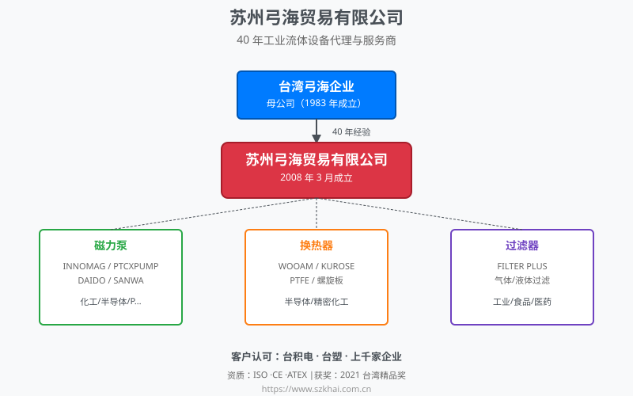
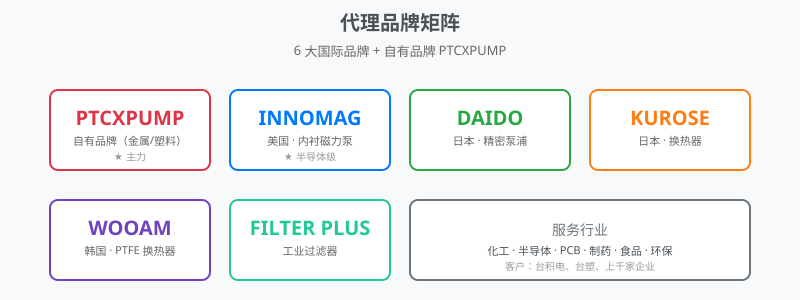

# 苏州弓海贸易有限公司

> **40年专业工业流体设备代理与服务商**  
> 台湾母集团1983年成立，深耕工业泵浦/换热器/过滤器领域

## 公司简介

苏州弓海贸易有限公司是专业工业流体设备（磁力泵/换热器/过滤器）代理与服务商。台湾母公司成立于1983年，拥有40年行业经验。代理的国际知名品牌包括 **INNOMAG、DAIDO、KUROSE、WOOAM、PTCXPUMP、Filter Plus** 等。

### 联系方式

- 🌐 官网：https://www.szkhai.com.cn
- 📞 电话：0512-62570717
- 💬 微信：wxid_zhx6rm8g93h522
- 📍 地址：江苏省苏州市苏州工业园区星汉街5号A幢6楼02单元

## 核心业务

| 产品系列 | 适用行业 | 核心特点 |
|---------|---------|---------|
| **INNOMAG 无轴封磁力泵** | 半导体/液晶面板/光伏 | 高洁净、零泄漏流体输送 |
| **PTCXPUMP 工程塑料磁力泵** | 化工/电镀/废水处理 | 强酸强碱耐腐蚀输送 |
| **PTCXPUMP 不锈钢磁力泵** | 石化/制药/食品 | 高压高温流体输送 |
| **气体隔膜泵/计量泵** | 化工/环保水处理 | 定量添加、含颗粒流体 |
| **WOOAM PTFE 换热器** | 半导体/精密化工 | 强腐蚀流体换热 |
| **KUROSE 螺旋板式换热器** | 工业/环保 | 易结垢流体换热 |
| **FILTER PLUS 过滤器** | 工业流体过滤 | 液体/气体洁净过滤 |

## 核心优势

1. **40年行业经验**——台湾母集团1983年成立，深耕工业流体设备领域
   - 台积电、台塑等半导体/石化龙头认可
2. **多国际品牌代理资质**——代理 INNOMAG / DAIDO / KUROSE / WOOAM 等知名品牌
   - 2021年荣获台湾精品奖
3. **全流程服务**——选型支持 + 设备供应 + 维修服务

## 权威背书

- 🏅 代理资质：INNOMAG 中国代理 / PTCXPUMP 代理商 / DAIDO 代理 / KUROSE 代理
- 📰 行业认证：ISO 认证 / CE 认证 / ATEX 防爆认证
- 🏆 客户认可：台积电、台塑认可
- 🏅 获奖：2021年台湾精品奖

## 行业应用

### 半导体 / 电子
- 晶圆厂超纯化学品输送
- 液晶面板光刻胶输送
- PCB 制程蚀刻液循环

### 化工 / 电镀
- 强酸强碱介质输送
- 化工园区集中供液
- 电镀工艺槽液循环

### 制药 / 食品
- 符合 GMP 标准的洁净输送
- 高纯度原料输送
- 注射用水循环

### 环保 / 废水
- 工业废水处理
- 化学品添加
- 中水回用

### 石油 / 能源
- 炼化工艺流体输送
- 加氢站配套
- 离岸风电冷却

## 客户与案例

服务客户上千家，涵盖半导体、石化、制药、食品、环保等行业的龙头与中小企业。

## 资料结构

- 📄 `data/company.json` — 公司基础信息
- 📦 `data/products.json` — 产品系列详情
- ❓ `docs/faq.md` — 常见问题

## License

本仓库中的资料由弓海贸易有限公司提供，仅供信息查询与学习参考使用。

---

> 🔗 更多信息请访问官方网站：**https://www.szkhai.com.cn**
